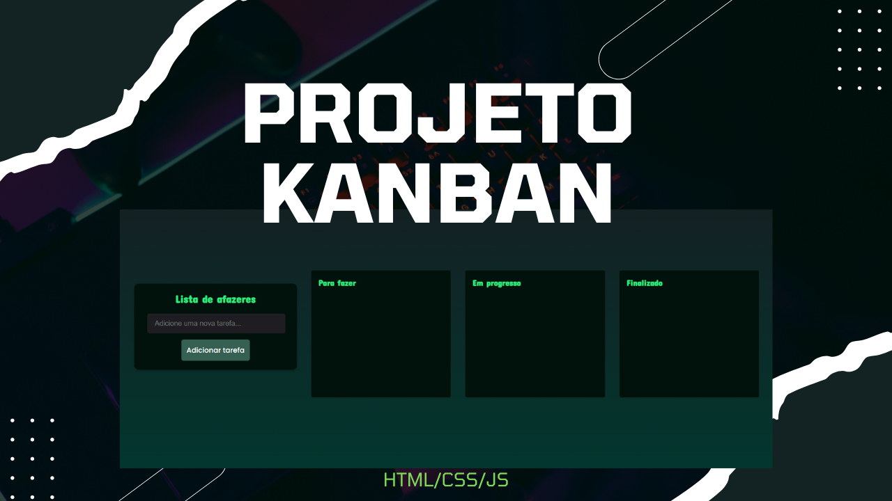

 

## 🖥️ Projeto

Este é um projeto de uma aplicação Kanban para lista de afazeres, que permite aos usuários organizar suas tarefas em três listas: "Para Fazer", "Em Progresso" e "Finalizado". A aplicação permite arrastar e soltar as tarefas entre as listas para uma melhor organização do fluxo de trabalho. O projeto foi desenvolvido utilizando HTML, CSS e JavaScript.

### 🔎 Tecnologias

Esse projeto foi desenvolvido com as seguintes tecnologias:

- HTML
- CSS
- JavaScript
- Github

## 🎨 Instruções

- Para adicionar uma nova tarefa, digite o nome da tarefa na caixa de texto na parte esquerda da página.
- Pressione o botão "Adicionar tarefa" para adicionar a tarefa à lista.
- As tarefas podem ser arrastadas e soltas entre as listas, basta pressioná-las.
- Para remover uma tarefa da lista, clique no botão "Remover" ao lado da tarefa que você deseja excluir. A tarefa será removida imediatamente da lista.

### 🧑‍💻 Creditos

Professor [Luan Oliveira](https://www.linkedin.com/in/luanpdd/).